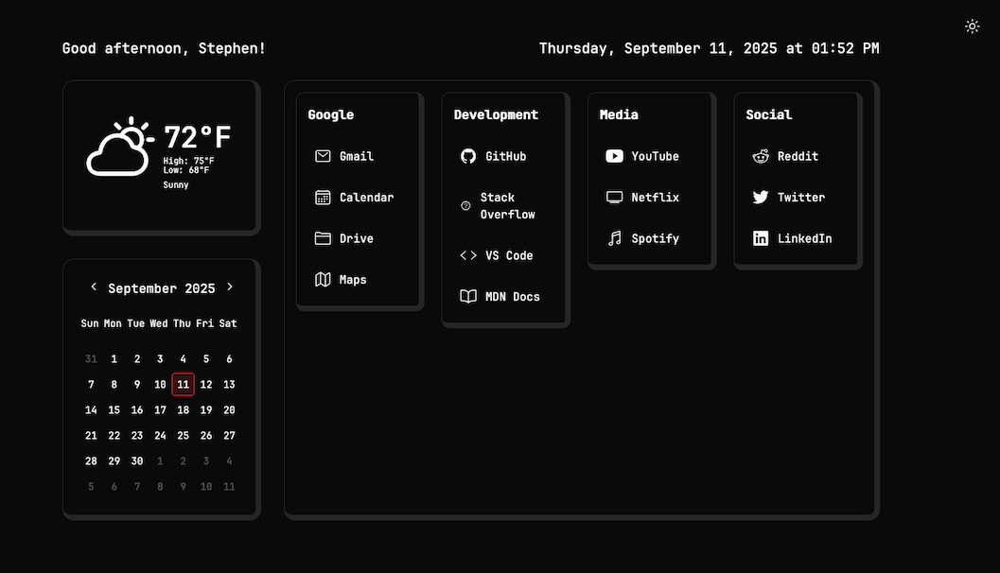

# Custom Start Page

A modern, customizable browser start page with dark/light themes, weather integration, and organized quick links.



## Features

- 🌓 **Dark/Light Theme Toggle** - Seamless theme switching with persistent preferences
- 🌤️ **Weather Widget** - Real-time weather data with OpenWeather API integration
- 📅 **Calendar Widget** - Interactive monthly calendar with today highlighting
- 🔗 **Organized Quick Links** - Categorized bookmark groups with custom icons
- 📱 **Responsive Design** - Works perfectly on desktop, tablet, and mobile
- 🎨 **3D Visual Effects** - Modern card design with elevated borders
- ⚡ **Fast & Lightweight** - Single HTML file, no build process required
- 🎯 **Customizable** - Easy configuration through JavaScript variables

## Quick Start

1. **Download** the `startpage.html` file
2. **Set as homepage** in your browser
3. **Customize** the configuration (see below)
4. **Enjoy** your personalized start page!

## Customization

### Basic Configuration

Open `startpage.html` and modify the configuration section:

```javascript
// --- USER CONFIGURABLE SECTION ---
const greetingName = "Your Name!"; // Personalized greeting
const weatherLocation = "Your City"; // City name or "lat,lon" coordinates
const weatherApiKey = "your_api_key_here"; // OpenWeather API key (optional)

// Add your quick links
const quickLinks = [
  { name: 'Gmail', url: 'https://gmail.com', icon: 'mail-outline', category: 'Google' },
  { name: 'GitHub', url: 'https://github.com', icon: 'logo-github', category: 'Development' },
  // Add more links...
];

// Define your categories (controls display order)
const linkCategories = ['Google', 'Development', 'Media', 'Social'];
```

### Weather Setup (Optional)

1. Get a free API key from [OpenWeatherMap](https://openweathermap.org/api)
2. Add your API key to `weatherApiKey`
3. Set your location in `weatherLocation`:
   - City name: `"New York"`
   - Coordinates: `"40.7128,-74.0060"`

### Icons

Icons use [Ionicons](https://ionic.io/ionicons). Popular options:
- `mail-outline`, `calendar-outline`, `folder-outline`
- `logo-github`, `logo-twitter`, `logo-youtube`
- `code-outline`, `book-outline`, `musical-notes-outline`

### Categories

Organize links into categories that display as separate columns:
```javascript
const linkCategories = ['Work', 'Social', 'Entertainment', 'Tools'];
```

## Browser Setup

### Chrome/Edge
1. Settings → On startup → Open a specific page
2. Add your local file: `file:///path/to/startpage.html`

### Firefox
1. Settings → Home → Homepage and new windows
2. Select "Custom URLs" and add your file path

### Safari
1. Preferences → General → Homepage
2. Set to your local file path

## Features in Detail

### Theme Toggle
- **Sun icon** in dark mode (click to switch to light)
- **Moon icon** in light mode (click to switch to dark)
- Located in top-right corner
- Preferences saved in browser localStorage

### Weather Widget
- Current temperature display
- High/low temperatures on separate lines
- Weather conditions description
- Automatic fallback if API unavailable

### Calendar
- Interactive month navigation
- Today's date highlighted
- Responsive grid layout

### Quick Links
- **Categorized organization** - Links grouped by category
- **3D card effects** - Modern elevated design
- **Equal-width columns** - Balanced layout
- **Hover effects** - Visual feedback on interaction

## Browser Compatibility

- ✅ Chrome 88+
- ✅ Firefox 85+
- ✅ Safari 14+
- ✅ Edge 88+

## Dependencies

- [Tailwind CSS](https://tailwindcss.com/) (CDN)
- [Ionicons](https://ionic.io/ionicons) (CDN)
- [OpenWeather API](https://openweathermap.org/api) (optional)

## Contributing

1. Fork the repository
2. Create your feature branch
3. Commit your changes
4. Push to the branch
5. Open a Pull Request

## License

This project is open source and available under the MIT License.

---

Made with ❤️ for a better browsing experience
